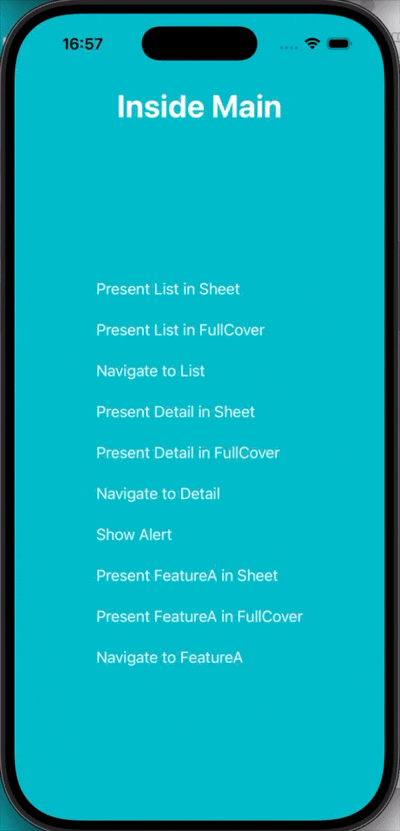
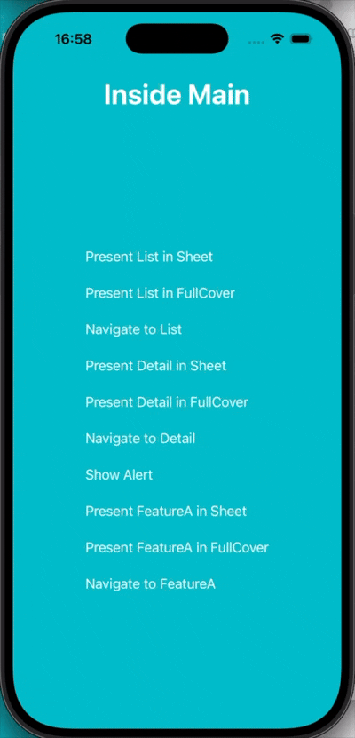
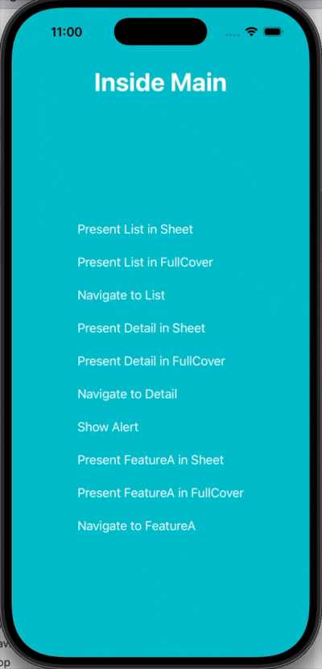

## Library to separate Navigation Layer in SwiftUI.

Opportunities:
- Navigation:

- Separate Route chains:

- Pop-to-approot/Pop-to-routerroot:

- Single view in stack/Single view on top:

- Replace navigation stack:

